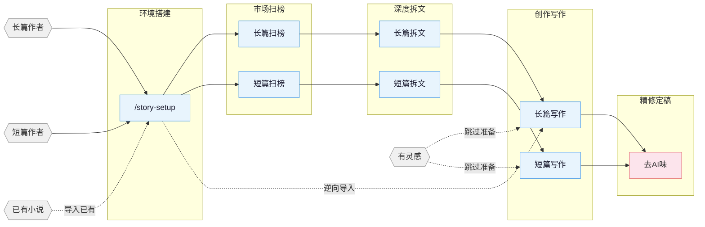

[English](README_EN.md) | **中文**

# AI网文小说创作工具包

一个面向 Claude Code 和 OpenClaw 的网络小说写作技能包，覆盖长篇与短篇网络小说的扫榜、拆文、写作、去AI味、封面生成全流程。

## 核心方法论

> **套路 = 确定性情绪回报**

职业作者遵循三步法：1. 扫榜 — 分析排行榜，识别题材、人物、切入点；2. 拆文 — 拆解节奏与剧情素材，建立个人模块库；3. 商业化 — 学习并应用钩子、爽点密度、预期管理。

围绕四大支柱构建：爆款逆向工程、剧情模块化、分层状态管理、人机协作写作。

## 创作流程概览



## 安装方式

**方式一** 直接告诉 Claude Code / OpenClaw：

```
Install this skill https://github.com/worldwonderer/oh-story-claudecode
```

**方式二** 命令行安装：

```bash
npx skills add worldwonderer/oh-story-claudecode -y
```

再次运行相同命令即可更新。

## 技能列表

| 技能 | 触发方式 | 功能说明 |
|:------|:--------|:---------|
| `story-setup` | `/story-setup` | 环境部署 — 一键部署钩子/规则/代理/CLAUDE.md |
| `story` | `/story` | 工具箱路由 — 将模糊意图路由到匹配的技能 |
| `story-long-write` | `/story-long-write` | 长篇写作 — 大纲搭建、人物设计、正文输出 |
| `story-long-analyze` | `/story-long-analyze` | 长篇拆文 — 黄金三章、爽点设计、节奏分析 |
| `story-long-scan` | `/story-long-scan` | 长篇扫榜 — 起点/番茄/晋江市场趋势 |
| `story-short-write` | `/story-short-write` | 短篇写作 — 情绪设计、反转构思、精修出稿 |
| `story-short-analyze` | `/story-short-analyze` | 短篇拆文 — 故事核、结构、情感线、反转设计、写作手法、共鸣分析 |
| `story-short-scan` | `/story-short-scan` | 短篇扫榜 — 知乎盐言/番茄短篇热点数据 |
| `story-deslop` | `/story-deslop` | 去AI味 — 检测并清除AI写作痕迹 |
| `story-import` | `/story-import` | 逆向导入 — 将已有小说解析为标准项目结构 |
| `story-review` | `/story-review` | 多视角审查 — 4 Agent对抗式审查 + 番茄/起点/知乎评分标准 |
| `story-cover` | `/story-cover` | 封面生成 — 书名题材分析 + GPT-Image-2图像生成 |
| `browser-cdp` | `/browser-cdp` | 浏览器控制 — CDP协议实现带登录态复用的网页抓取 |

自然语言触发示例：`帮我开书` → `story-long-write`，`这篇太AI了` → `story-deslop`，`把我的书导进来` → `story-import`，`沈栀现在什么状态` → `story-explorer`。

<details>
<summary>封面生成示例</summary>


</details>

<details>
<summary>拆文示例 — 《盘龙》</summary>

使用 `/story-long-analyze` 深度模式分析《盘龙》前23章的完整输出：

```
demo/拆文库-盘龙/
├── 概要.md              # 全书概要 + 章节索引
├── 拆文报告.md           # 五维评分 + 节奏分析 + 可借鉴套路
├── 章节/
│   ├── 第1章_深度拆解.md  # 黄金三章深度分析
│   └── 第1-23章_摘要.md   # 每章摘要 + 情节点 + 角色提及
├── 角色/
│   ├── 林雷.md           # 主角完整档案
│   ├── 霍格.md           # 核心配角
│   ├── 希尔曼.md         # 核心配角
│   ├── 德林柯沃特.md      # 核心配角
│   ├── 沃顿.md           # 功能型角色
│   └── 角色关系.md        # 关系网络
├── 剧情/
│   └── 故事线.md          # 框架识别 + 4条剧情线 + 2条故事线
└── 设定/
    ├── 世界观.md          # 力量体系 + 地理 + 势力
    └── 金手指.md          # 盘龙戒指 + 德林柯沃特
```

</details>

## Agent 系统

写作技能内部协调 7 个专业代理：

| 代理 | 模型 | 职责 |
|:------|:------|:-----|
| **story-architect** | Opus | 故事架构师 — 题材定位、大纲结构、钩子/反转设计、情绪弧线 |
| **character-designer** | Sonnet | 人物设计师 — 角色档案、语言风格、动机链、对话写作 |
| **narrative-writer** | Sonnet | 叙事作家 — 正文写作、去AI味、格式合规 |
| **consistency-checker** | Haiku | 一致性检查器 — 事实冲突扫描、伏笔追踪、S1-S4分级报告 |
| **story-researcher** | Sonnet | 研究员 — CDP搜索+全文提取、多源交叉验证、结构化参考文件 |
| **story-explorer** | Haiku | 故事查询器 — 只读式角色/伏笔/设定/进度查询、快速上下文加载 |
| **chapter-extractor** | Haiku | 章节提取器 — 摘要、情节点、角色提及、平行拆文单元 |

代理按需从 `references/` 加载写作理论（人物设计、对话技巧、反转工具箱等 — 100+ 方法论文件），不占用上下文窗口空间。

## v0.6.6 升级说明

如果你已经在写作项目中运行过 `/story-setup`，更新本技能包后请从项目根目录再次运行 `/story-setup`。

本次版本将 `agents_version` 升级到 v7，重点优化 40+ 章长篇日更项目中的 Token 爆炸问题：

- `/story-long-write 日更` 进入每日批量流程后，同批次的「继续/重写/日更」请求保留在 `workflow-daily.md` 内，不再直接跳转正文写作
- 每章写作前必须读取当期具体项目文件：本章细纲、上章正文、`追踪/上下文.md`、`追踪/伏笔.md`、`追踪/时间线.md`、角色状态/设定
- SessionStart 钩子现在仅对「已过期」或异常伏笔状态发出警告；正常开放状态（未埋/已埋）不再触发完整伏笔审计
- 日更仅处理当批增量伏笔变更；需要完整审计时请显式运行 `/story-review`

## 自动化钩子

`/story-setup` 自动部署 6 个钩子：

| 钩子 | 触发时机 | 功能 |
|:-----|:---------|:-----|
| session-start.sh | 会话启动 | 显示分支、进度快照、拆文状态 |
| session-end.sh | 会话结束 | 将会话记录到 `追踪/session-log.txt` |
| detect-story-gaps.sh | 会话启动 | 检测设定缺失、大纲遗漏、伏笔断线 |
| pre-compact.sh | 上下文压缩前 | 保存进度快照路径和行数摘要 |
| post-compact.sh | 上下文压缩后 | 提示读取进度快照恢复上下文 |
| validate-story-commit.sh | git commit | 检查硬编码属性、设定必填字段（仅警告，不阻塞） |

## 项目文件结构

长篇小说轻松达到数十万字数、数百章节。设定冲突、伏笔断裂、时间线矛盾 — 仅凭记忆管理无异于灾难。

文件系统将设定、大纲、正文、追踪分离为独立维度。对话负责创作，文件系统负责记忆。

**长篇项目结构：**

```
{书名}/
├── 设定/
│   ├── 世界观/              # 背景、力量体系等 — 每个主题一个文件
│   ├── 角色/                # 每个角色一个文件（沈栀.md、陆砚之.md）
│   ├── 势力/                # 每个势力/组织一个文件（天机阁.md）
│   ├── 关系.md              # 角色关系映射
│   └── 题材定位.md          # 核心梗 + 对标分析
├── 大纲/
│   ├── 大纲.md              # 全书卷级结构
│   ├── 卷纲_第1卷.md         # 每卷一个：爽点节奏 + 情绪弧线 + 人物弧线 + 伏笔 + 反转
│   ├── 细纲_第001章.md       # 每章一个：事件 + 钩子 + 爽点 + 悬念
│   └── ...
├── 正文/
│   ├── 第001章_章名.md
│   └── ...
├── 对标/                    # 对标参考（从拆文同步的结构化子目录）
│   └── {对标书名}/
│       ├── 原文/              # 对标书原文章节
│       ├── 角色/             # 结构化角色档案（从analyze同步）
│       ├── 剧情/             # 结构化剧情线（从analyze同步）
│       ├── 设定/             # 结构化世界观（从analyze同步）
│       └── 拆文报告.md        # analyze技能输出
├── 追踪/                    # 连续性管理（分层追踪）
│   ├── 上下文.md            # 写作上下文（用于压缩恢复）
│   ├── 伏笔.md              # 伏笔埋设/回收状态表（跨卷）
│   ├── 时间线.md            # 故事内时间线（全书）
│   └── 角色状态.md          # 角色当前状态快照（每章）
└── 参考资料/                # story-researcher输出
    └── {topic}.md           # 按研究主题拆分
```

**短篇项目结构：**

```
{书名}/
├── 正文.md                  # 完整短篇正文
├── 章节大纲.md              # 分节大纲（情绪 + 钩子 + 事件）
├── 自检记录.md              # 写完后自检记录
└── 参考资料/                # 写作参考
    └── {topic}.md
```

**拆文库：** 拆文技能将结构化输出（角色、剧情线、设定、章节）保存在项目根目录 `拆文库/{书名}/` 下。写作技能通过 `对标/` 子目录消费这些资产，或自动回退到拆文库读取。

## 知识库

每个技能包含按需加载的 `references/` 知识库，保持上下文精简。

| 主题 | 内容 | 技能 |
|:------|:------|:------|
| 大纲布局 | 五步大纲法 · 故事结构层次 · 节点设计 · 升级感设计 | long-write |
| 开篇设计 | 开篇模式 · 前500字 · 黄金三章 | long-write / short-write |
| 人物设计 | 角色档案 · 人物提取 · 关系映射 · 动机链 · 群像设计 | long-write / short-write / short-analyze |
| 钩子技巧 | 13式章尾钩子 · 7式章首钩子 · 段落级钩子 · 悬念编排 | long-write / short-write / short-analyze |
| 情绪设计 | 6种弧线模板 · 预期管理 · 题材赛道策略 | long-write / short-write |
| 题材框架 | 长篇8节点 · 短篇压缩三幕 · 8种题材开篇模板 | long-write / short-write / short-analyze |
| 对话技巧 | 节奏 · 潜台词 · 信息控制 · 对话模式库 | long-write / short-write |
| 反转工具箱 | 类型 · 时机 · 误导基线路径 | long-write / short-write |
| 风格模块 | 对话 · 打斗 · 智斗 · 镜头化写作 · 打脸 · 白描 | long-write |
| 进阶技巧 | 四步微大纲 · 高潮逆向工程 · 双线结构 · AB交织 | long-write |
| 去AI味 | 预防 · 三遍去AI法 · 改写示例 · 禁用词表 | deslop / long-write / short-write |
| 质量检查 | 通用 · 长篇专项 · 短篇专项 · 有毒套路检测 | long-write / short-write / short-analyze |
| 写作公式 | 21种题材公式 · 三翻四抖 · 言情四阶段 | short-write / short-analyze |
| 女性向写作 | 女频读者偏好 · 情感描写 · 言情模式 · 对标分析 | short-write |
| 拆文方法 | 黄金三章 · 情绪曲线 · 结构拆解 · 知乎风格分析 | long-analyze / short-analyze |
| 短篇方法论 | 故事核 · 情节节点 · 爆点分析 · 写作手法 · 节奏分析 · 共鸣分析 · 人物分类 · 平台适配 | short-analyze |
| 拆文示例 | 完整案例拆解 · 模板输出 | short-analyze |
| 读者画像 | 9维度画像 · 目标读者分析 | long-scan |
| 市场数据 | 题材趋势 · 平台特性 · 合集形式 · 投稿指南 | long-scan / short-scan |
| 封面风格 | 10种题材视觉风格 · 色彩构成 · 提示词模板 | story-cover |
| 对抗式审查 | 多视角审查 · 评分标准 · 有毒套路检测 | story-review |

## 支持平台

**长篇** 起点中文网 · 番茄小说 · 晋江文学城 · 七猫小说 · 刺猬猫

**短篇** 知乎盐言故事 · 番茄短篇 · 七猫短篇

这个技能包最初是我在求职转型期间为自己打造的工具 :joy:，希望也能帮到其他人。

## Star History

<a href="https://www.star-history.com/?repos=worldwonderer%2Foh-story-claudecode&type=date&legend=top-left">
 <picture>
   <source media="(prefers-color-scheme: dark)" srcset="https://api.star-history.com/chart?repos=worldwonderer/oh-story-claudecode&type=date&theme=dark&legend=top-left" />
   <source media="(prefers-color-scheme: light)" srcset="https://api.star-history.com/chart?repos=worldwonderer/oh-story-claudecode&type=date&legend=top-left" />
   
 </picture>
</a>

## 贡献

欢迎贡献新技能、补充知识库、更新市场数据。详见 [CONTRIBUTING.md](CONTRIBUTING.md)（中文）。

## 致谢

- [LINUX DO - 新理想社区](https://linux.do) — 社区支持
- [FanqieRankTracker](https://github.com/wen1701/FanqieRankTracker) — 番茄小说字体反爬解码方案参考
